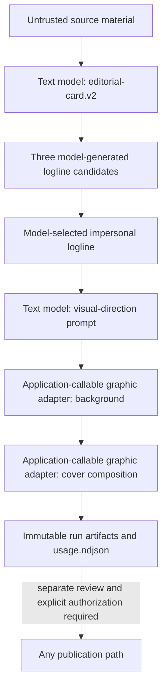

# Instagram cover pipeline

## Scope and current boundary

This document describes the model-driven cover-preparation contract. It does
**not** authorize a post, deployment, or credential change.

## Automatic digest white card

The digest pipeline now separately prepares a reviewable white 1080×1350 JPEG
after it saves a digest. This is not the graphical cover-lab flow described
below: it takes the first seven assembled digest entries, asks the canonical
`top5-hook.v1` prompt to choose five factual hooks plus a continuation promise,
and renders that model-approved text with a fixed readable layout. The asset
and append-only usage/cost receipt live in `digest_stage_artifacts`; the JPEG is
served from `/digest-card-images/<artifact-id>.jpg` for a later publisher.

This automatic preparation neither creates an Instagram media container nor
posts anything. A delivery integration must consume the stored successful JPEG
and must not regenerate copy or replace it with a placeholder.

`src/pro/services/autoposter.js` publishes an available source-post image
unchanged. When the source post has no image, it creates one custom,
source-grounded background through the production OpenAI/FAL preparation path,
normalizes it to a JPEG, persists a dedicated receipt, and only then uses the
public `/post-images/` URL for the existing Instagram delivery flow. The
generated asset is not a source asset and is reused on a deliberate retry; a
missing stored asset fails closed rather than regenerating a different visual.
The cover lab itself still never invokes the autoposter or Instagram API.

`production/image/src/generate.js` is a legacy standalone script. Its direct
FAL use and local Sharp text overlay do not satisfy the v2 provenance or
model-driven composition contract below; it is not the production integration
point for r02. Do not deploy or use it as evidence that a v2 cover was
prepared.

## v2 preparation flow

The v2 flow is a sequence of recorded model calls, not a template/Sharp
workflow. All semantic text and visual concepts are produced by the model whose
artifact records them. Application code performs only schema validation,
hashing, deterministic image normalization, and safe storage.

1. **Editorial.** The versioned prompt returns a source-grounded hook, facts,
   three candidate loglines, and one logline selected by the text model. The
   logline is direct impersonal explanatory copy; it does not describe an
   author, a post, or a narrator. A human may review returned candidates but
   must not replace one with handwritten copy in the pipeline.
2. **Visual direction.** A separate text-model call turns only structured,
   model-produced editorial data into a visual brief.
3. **Background.** The application invokes a configured graphic provider via a
   supported adapter. The adapter, rather than a Codex tool, submits the exact
   versioned prompt and persists provider/model/request/artifact provenance.
4. **Composition.** A second graphic-model call creates the final cover from
   the recorded composition prompt. Sharp or another local tool may verify or
   normalize image bytes only; it does not draw a semantic text overlay or make
   a visual selection.

The application adapter supports `fal-ai/flux/dev` for a background and the
current lab composition route, `fal-ai/recraft/v3/image-to-image`, which
receives the background URL. The Flux r02 run and the partial Recraft r03 trial
both failed the exact-readable-Russian-typography quality gate. They prove
model-call and provenance behaviour, not a publish-ready composition route;
neither result may be repaired with a local overlay. A provider response may
omit token or cost data. The run then records the field as
`not_reported_by_provider`; it never invents a price, model usage, or
zero-token value.

## Versioning, usage, and review evidence

An immutable run uses versioned prompt files (`*.v1.md`, `*.v2.md`, …) and
records prompt-file and rendered-prompt hashes. A v2 editorial result contains
both the raw model-generated candidates and the model-selected logline, so an
owner can inspect what the API actually returned.

Every text or graphic attempt has a matching append-only `usage.ndjson` entry:
run/sample/step/attempt, provider/model, reasoning setting, prompt hash,
input/output/total usage or explicit unknowns, status, time, and any available
provider request ID. Result artifacts additionally preserve output and image
hashes. Failed and rejected attempts are ledgered too. Secrets never enter the
run or ledger.

`fb10-r01-20260720` remains a historical graphical experiment. It used a
non-application Codex image tool whose exact model and token usage were not
exposed. A later v2/r02 run is required for model-driven, application-callable
evidence; r01 must not be modified or relabelled as such.

## Publication remains separate

No cover-lab command publishes to Instagram, creates a media container, sends
browser actions, uploads to a public URL, or posts overflow comments. The lab
remains review-only. The separately tested Autoposter runtime path uses the
normal explicit distribution action and its existing one-shot media-publish and
continuation-reconciliation protections; this documentation change does not
authorize deployment or an external post.

See [cover-lab](cover-lab/README.md) for run, validation, provenance, and
safety details.
